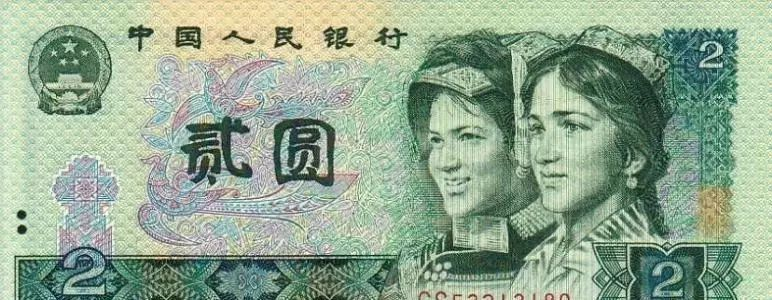
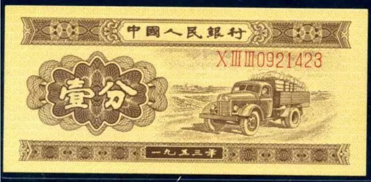
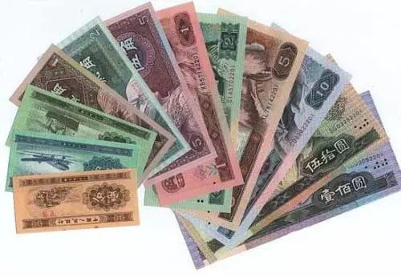
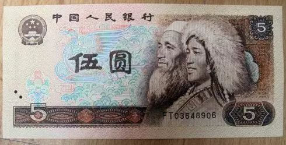

## 收藏钱币的价值和意义

钱币作为法定货币，在商品交换过程中充当 一般等价物的作用，执行价值尺度、流通手段、支付手段、贮藏手段和世界货币 五种职能，这是钱币作为法定货币在流通领域中具有的职能。然而，当抛开其作为法定货币的角色，而作为一种艺术品和文物， 钱币又具有了另一种特殊的职能——收藏价值。

**01**

**
艺术欣赏
**

不论是人民币金属币，还是人民币纸币；不论是普通流通人民币，还是纪念性流通人民币；不论是已经退出流通领域的人民币，还是现实流通的人民币；不论是古钱币，还是外国钱币，其图案不仅有代表性的历史人物图像，也有名山大川、风景名胜、国卉名花。

这些艺术图案都是经过著名的艺术家群体反复揣摩、精心设计的，它们都是一幅幅精美绝伦的艺术品，具有极高的艺术价值和欣赏价值。因此，从钱币身上可以得到美的享受、艺术的熏陶。

**02**

**
知识与功能
**

从钱币身上，我们可以了解到政治、经济、历史、文化、艺术以及科技等很多方面的知识，通过这些知识使人们受到各种教育。从钱币人物图案上可以了解各国不同时期政治、经济、文化、艺术，例如：第三套人民币中的1角券正面图案，反映了党的教育方针——“教育与生产劳动相结合”；第四套人民币通过不同的人物图案，反映了老一代无产阶级革命家的光辉形象，体现了我国是一个统一的多民族国家，体现出社会主义建设事业必须依靠工人、农民和知识分子，以及团结一切可以团结的力量的政策。从人民币名山大川、风景名需要继承和弘扬的传统文化。从人民币上的轮船、火车、汽车、飞机、收割机、桥梁、水电站等图案可以了解我国不同时期工农业生产和交通运输情况，这些图案也反映了我国社会主义建设不同时期的成就。

人民币上不仅有上述各种精美的艺术图案，而且作为我国的法定通货，票面上均印有国徽(第一套人民币诞生时因国微还未设计故未印国徽图案)，这是国家权力的象征，表明人民币的法定地位，同时也时刻唤起人们的爱国意识。另外，从人民币材质、印制等方面，也可以了解有关水印、油墨、印制技术等方面的知识。总之，小小钱币，知识大世界。钱币流通的世界性，决定其是一种极为特殊的宣传品，具有任何一种宣传媒介无法比拟的广泛性，因此，人民币的普及知识和教育功能是不容低估的。

**03**

**
文物价值
**

印制铸造质量反映了当时的印制铸造技术和工艺水平。

因此，从诞生和流通于不同时期的钱币票面上，就能了解到当时的政治、经济、历史背景。

**04**

**
保值增值
**

随着钱币收藏队伍的不断壮大，一些停用退出流通领域的钱币和限量发行的金属流通纪念币越来越少。

受价值规律影响，这些钱币价值直线上升，并随时间推移，增值潜力越来越大。

**随着人们物质生活水平的提高，人们的精神文化生活将更加丰富多彩，一股新的群众性的钱币收藏热潮必将更加高涨。钱币的艺术性、知识性、史料性和娱乐性在全国人民文化生活中也必将发挥它独特的作用。**